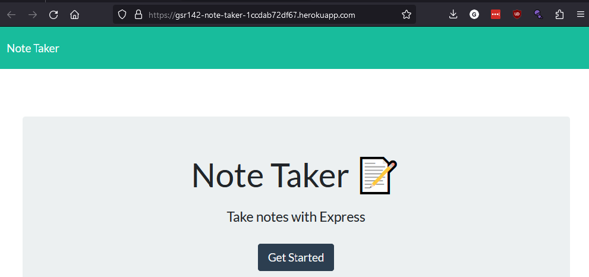

# Note-taker

## Table of Contents:
1. [Description](#description)
2. [Installation](#installation)
3. [Usage](#usage)
4. [Contributions](#contributions)
5. [Code Credit](#code-credit)
6. [License](#license)
7. [Technologies Used](#technology)
8. [GitHub](#github)
9. [Email](#email)
  
  
## Description
A web application that allows the user to write and store notes. The notes are stored in a json file on a remote server.

## Installation
No need to install. Just visit the site. [Click Here!](https://gsr142-note-taker-1ccdab72df67.herokuapp.com/)

## Usage
Click get started and begin taking notes. Save the notes by clicking

## Contributions
Create a pull request or contact me through email or on github.

## Code Credit
* The GET and POST requests in the server.js file were written with assistance from TA Kyle Vance, and Tutor Andrew Tirpok. Your support is greatly appreciated. 
* The front end code was obtained from the UC Berkley Coding Bootcamp materials.

## License
 

## Technologies Used
* [JavaScript](https://developer.mozilla.org/en-US/docs/Web/JavaScript)
* [NodeJS](https://nodejs.org/en)
* [Express](https://expressjs.com/)

## Questions
For qestions about the project you can contact me on GitHub or via email

### Github
[gsr142](https://github.com/gsr142)

### Email
[gsr142@gmail.com](gsr142@gmail.com)